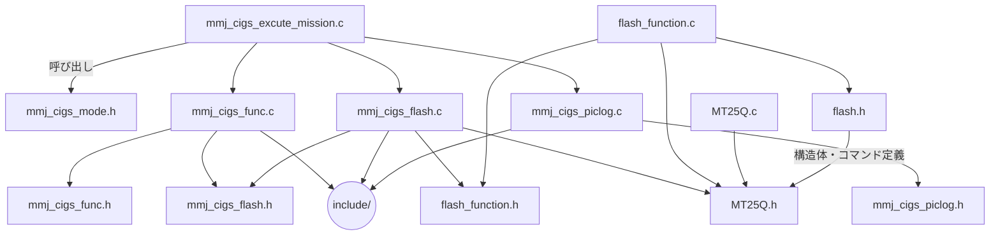

# MMJ_SW_053_CIGS_PIC

## ファイル関係図（概要）

- `mmj_cigs_excute_mission.c` から各種機能（フラッシュ、ログ、モード等）を呼び出し
- フラッシュ制御は `mmj_cigs_flash.c` → `flash_function.c` → `MT25Q.c` の順で下層へ
- 構造体やコマンド定義は `MT25Q.h` や `flash.h` で一元管理
- 各種 include/ ディレクトリでヘッダ管理

※詳細な依存関係は各 .h ファイルの include を参照

## コマンド一覧
### フラッシュ操作
| 関数名                　| 実行する処理                                                             
| -------------------   | -----------------------------------------------------------------------
| make prepare          | node_modules のインストール、イメージのビルド、コンテナの起動を順に行う
| make build            | イメージのビルド                                                         
| make down             |  コンテナの停止                                                          
| make loaddata         | テストデータの投入                                                       
| make makemigrations   | マイグレーションファイルの作成
