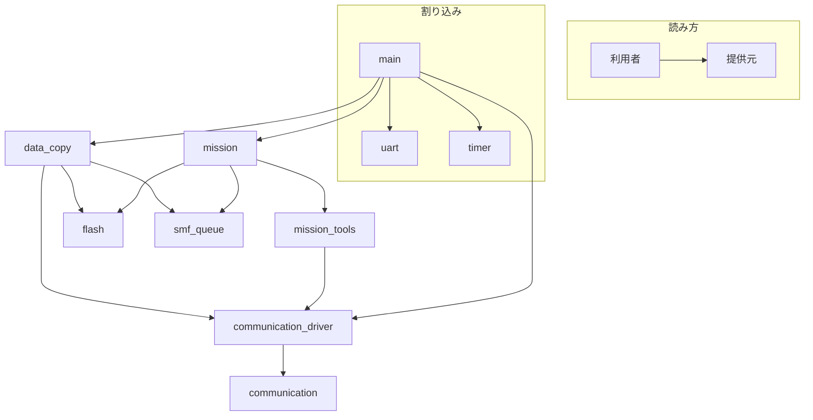

# ソフトウェア設計書

## 目的
本書は、MIS MCUに実装されるソフトウェアの動作仕様、構成モジュール、グローバル変数、定数、およびデータ構造を体系的に記述するものである。<br>設計意図および責務分離を明確にし、保守性・拡張性の高いソフトウェア実装を支援することを目的とする。


### 基本機能
MIS MCUは以下の3機能を中心に構成される
- **BOSS PICとの通信機能** : コマンド、ステータスのやり取り
- **ミッション実行機能** : 受信コマンドに基づくミション動作
- **データコピー機能** : ミッション実行で生成したデータをSMFにコピーする機能


## ライブラリ関係


- communication         ... 機器共通の通信機能
- communication_driver ... MIS MCU用にcommunicationライブラリを拡張したもの
- mission               ... ミッション実行機能
- mission_tools         ... missionが利用できるツール群
- data_copy             ... FMからSMFへのコピー機能
- smf_queue            ... SMFへのデータコピー機能を実行するためのキュー管理機能
- flash                 ... 衛星においてすべての機器に共通して使用されるフラッシュメモリーの操作機能を提供する


### main処理フロー概要
```c
while (TRUE) {
    if (BOSS PICからの信号がある)
        コマンドの生成
        if (コマンドが妥当なものである)
            コマンド実行(execute_command)

    if (ミッション完了 && SMFへのコピーリストなし)
        ステータス = 動作終了

    if (動作終了ステータスをBOSS PICに送信済み)
        break;
}
```
```c
コマンド実行
{
    if (もしアップリンクコマンドなら)
        BOSS PICにACK送信
        ミッション実行

    else if (もしBOSS PICからのステータスチェックなら)
        BOSS PICにステータス送信

    else if (もしSMFの使用の可否なら)
    {
        BOSS PICにACK送信
        if (もし使用可能なら)
            データをSMFへコピー
    }
}
```

### 割り込み処理
- INT_TIMER0 ... 0.01秒ごとに割り込み
- INT_RDA    ... UART受信割り込み


## グローバル変数一覧
### value.h
- 時間管理
    - unsigned int32 subsec：サブ秒カウンタ（0.01秒単位）
    - unsigned int32 sec：秒カウンタ
    - unsigned int16 day：日数カウンタ

- 通信バッファ
    - unsigned int8 boss_receive_buffer[CONTENT_MAX]：BOSS PICからの受信バッファ
    - int8 boss_receive_buffer_size：受信バッファのサイズ

- MIS MCUのステータス
    - int8 status：現在のMIS MCUの状態


### communication.h
- フレームIDと長さの対応
```c
const FrameID frame_ids[RECEIVE_FRAME_KINDS] = {
    {UPLINK_COMMAND, UPLINK_COMMAND_LENGTH},
    {STATUS_CHECK, STATUS_CHECK_LENGTH},
    {IS_SMF_AVAILABLE, IS_SMF_AVAILABLE_LENGTH}
}
```

### mission.h
- 状態管理
    - int1 is_use_smf_req_in_mission：ミッション中にSMF使用要求があったか

### smf_queue.h
- SMFへのデータコピーキュー
    - SmfDataStruct smf_queue[SMF_QUEUE_SIZE]